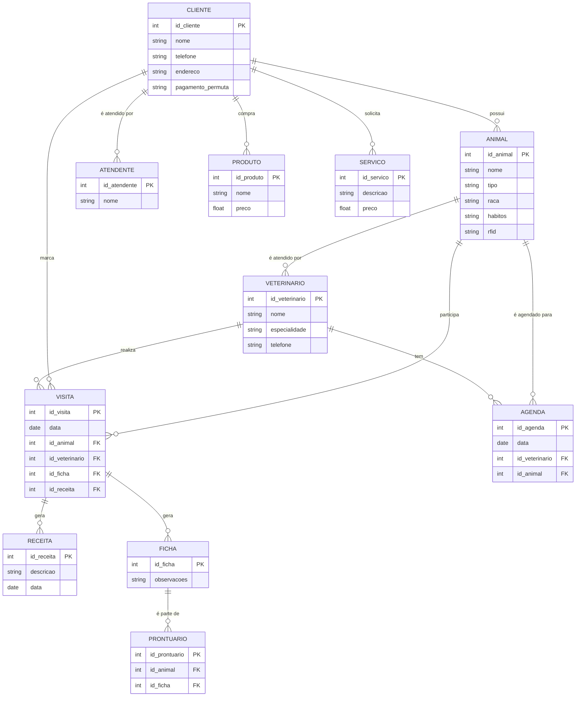

# natan_benites

- [natan\_benites](#natan_benites)
- [1. Introdução](#1-introdução)
- [2. Descrição do negócio](#2-descrição-do-negócio)
- [3. Visão geral do sistema](#3-visão-geral-do-sistema)
- [4. Diagrama ER](#4-diagrama-er)
- [5. Diagrama de classe](#5-diagrama-de-classe)
- [6. Casos de uso](#6-casos-de-uso)
  - [6.1. Histórias de usuário](#61-histórias-de-usuário)
- [7. Diagrama de Componentes](#7-diagrama-de-componentes)
- [8. Diagrama de Implantação](#8-diagrama-de-implantação)
- [9. Protótipo de telas](#9-protótipo-de-telas)
- [10. Diagrama e navegação de telas](#10-diagrama-e-navegação-de-telas)
- [11. Pilha tecnológica](#11-pilha-tecnológica)
- [12. Requisitos de sistema](#12-requisitos-de-sistema)
- [13. Considerações sobre segurança](#13-considerações-sobre-segurança)
- [14. Manutenção e instalação](#14-manutenção-e-instalação)
- [15. Glossário](#15-glossário)
- [16. Script SQL](#16-script-sql)

# 1. Introdução

    O projeto de a seguir apresenta um sistema desenvolvidor para uma petshop. A empresa é considerada micro e iniciou as atividades recentemente. Ao possuir serviços exclusivos, os sistemas presentes no mercado não se enquadram, desta forma, os proprietários decidiram desenvolver uma solução própria.

# 2. Descrição do negócio

Descrição do cenário onde o sistema deverá funcionar:

1. Marcar animais com RFID.
2. Uma clínica veterinária atende apenas os animais: gatos e cachorros.
3. Os clientes devem fazer um cadastro de si e dos animais.
4. Os clientes devem informar o tipo de ração que o animal come.
5. O cliente deve informar hábitos do animal.
6. Para cada animal é possível que mais de um veterinário o atenda.
7. Os animais podem chegar e serem atendidos de acordo com uma agenda do dia.
8. Cada animal atendido receberá uma ficha e um prontuário.
9. Outros dono podem querer marcar horários de atendimento futuro.
10. O atendimento gera uma receita para o animal.
11. Quando um cliente chega na clínica veterinária ele é atendido por um atendente.
12. O atendente deve verificar se existe agenda disponível com um veterinário.
13. O atendente deve colocar o cliente e seu animal na fila de espera, se for o caso.
14. O atendente deve levar o cliente e o animal até o veterinário.
15.  veterinário deve realizar uma entrevista com o dono do animal.
16.  O resultado da entrevista deve ir para um formulário
17.  O veterinário deverá examinar o animal e anotar em prontuário(ficha) suas observações.
18.  Dependendo da situação do animal este receberá uma receita.
19.  Registrar um histórico de visitas do animal.
20.  Comércio de roupas e brinquedos para os animais.
21.  Banho e tosa dos animais.
22.  Receita ganha com cada cliente

# 3. Visão geral do sistema

# 4. Diagrama ER

# 5. Diagrama de classe

# 6. Casos de uso

## 6.1. Histórias de usuário

# 7. Diagrama de Componentes

# 8. Diagrama de Implantação

# 9. Protótipo de telas

# 10. Diagrama e navegação de telas

# 11. Pilha tecnológica

# 12. Requisitos de sistema

# 13. Considerações sobre segurança

# 14. Manutenção e instalação

# 15. Glossário

# 16. Script SQL