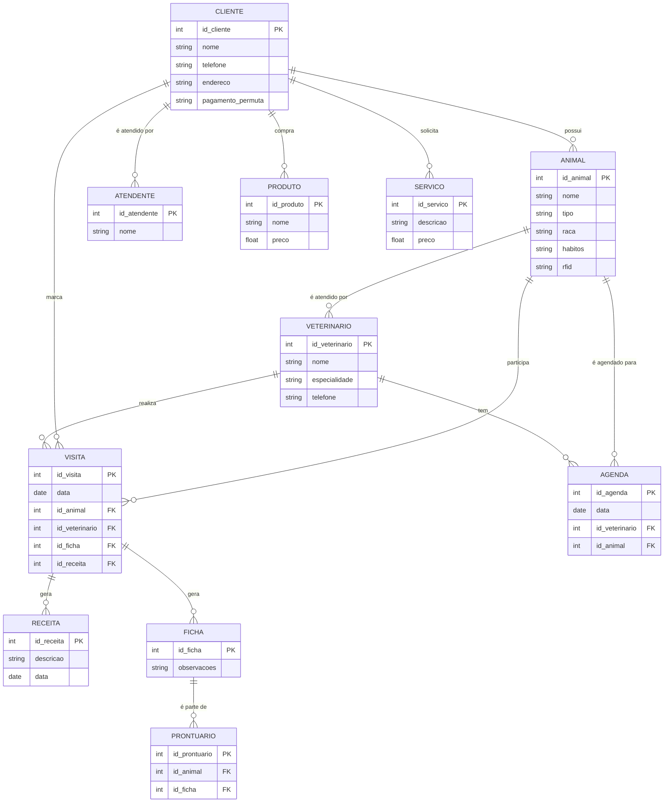
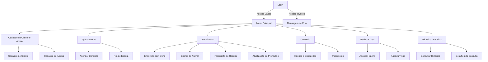
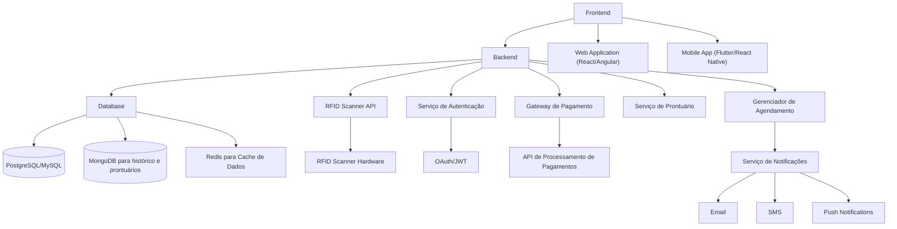

# natan_benites

- [natan\_benites](#natan_benites)
- [1. Introdução](#1-introdução)
- [2. Descrição do negócio](#2-descrição-do-negócio)
- [3. Visão geral do sistema](#3-visão-geral-do-sistema)
- [4. Diagrama ER](#4-diagrama-er)
- [5. Diagrama de classe](#5-diagrama-de-classe)
- [6. Casos de uso](#6-casos-de-uso)
  - [6.1. Histórias de usuário](#61-histórias-de-usuário)
    - [1. Sistema de Gestão de Estoque de Produtos para Pet](#1-sistema-de-gestão-de-estoque-de-produtos-para-pet)
    - [2. Plataforma de E-commerce para Petshop](#2-plataforma-de-e-commerce-para-petshop)
    - [3. Gerenciamento de Serviços de Banho e Tosa](#3-gerenciamento-de-serviços-de-banho-e-tosa)
    - [4. Aplicativo de Controle Financeiro para Petshops](#4-aplicativo-de-controle-financeiro-para-petshops)
    - [5. Sistema de Agendamento de Consultas Veterinárias](#5-sistema-de-agendamento-de-consultas-veterinárias)
    - [6. Ferramenta de Automação de Agendamentos de Serviços Pet](#6-ferramenta-de-automação-de-agendamentos-de-serviços-pet)
- [7. Diagrama de Componentes](#7-diagrama-de-componentes)
- [8. Diagrama de Implantação](#8-diagrama-de-implantação)
- [9. Protótipo de telas](#9-protótipo-de-telas)
- [10. Diagrama e navegação de telas](#10-diagrama-e-navegação-de-telas)
- [11. Pilha tecnológica](#11-pilha-tecnológica)
- [12. Requisitos de sistema](#12-requisitos-de-sistema)
  - [12.1 Requisitos Cliente](#121-requisitos-cliente)
      - [1: Acesso à internet](#1-acesso-à-internet)
      - [2: Navegador](#2-navegador)
      - [3: Sistema Operacional](#3-sistema-operacional)
      - [4: Possuir um Computador ou dispositivo Mobile](#4-possuir-um-computador-ou-dispositivo-mobile)
  - [12.2 Requisitos Servidor](#122-requisitos-servidor)
      - [1: Servidor de Banco](#1-servidor-de-banco)
      - [2: Servidor Web](#2-servidor-web)
      - [3: Aplicação do Banco de Dados](#3-aplicação-do-banco-de-dados)
      - [4: Máquina suporte](#4-máquina-suporte)
- [13. Considerações sobre segurança](#13-considerações-sobre-segurança)
  - [13.1 Lado Cliente](#131-lado-cliente)
      - [1: Regras de senha (Captcha; Quantidade minima de caracteres; Caracteres especiais e etc)](#1-regras-de-senha-captcha-quantidade-minima-de-caracteres-caracteres-especiais-e-etc)
      - [2: Autenticação de dois fatores](#2-autenticação-de-dois-fatores)
      - [3: Recuperar senha com email](#3-recuperar-senha-com-email)
      - [4: Código direto ao email](#4-código-direto-ao-email)
      - [5: Anti-vírus](#5-anti-vírus)
  - [13.2 Lado Servidor](#132-lado-servidor)
      - [1: Politica de backup de aplicação e bancos](#1-politica-de-backup-de-aplicação-e-bancos)
      - [2: Full Backup mensal](#2-full-backup-mensal)
      - [3: Backup a cada 15 dias](#3-backup-a-cada-15-dias)
      - [4: Admin do sistema não acessa aos dados do usuário](#4-admin-do-sistema-não-acessa-aos-dados-do-usuário)
- [14. Manutenção e instalação](#14-manutenção-e-instalação)
  - [14.1 Instalação direto ao servidor](#141-instalação-direto-ao-servidor)
  - [14.2 Manutenção](#142-manutenção)
  - [14.3 Novas Funcionalidades](#143-novas-funcionalidades)
- [15. Glossário](#15-glossário)
- [16. Script SQL](#16-script-sql)
  - [16.1 Comandos CREATE Table](#161-comandos-create-table)
  - [16.2 Comandos INSERT gerando dados fictícios](#162-comandos-insert-gerando-dados-fictícios)

# 1. Introdução

    O projeto de a seguir apresenta um sistema desenvolvidor para uma petshop. A empresa é considerada micro e iniciou as atividades recentemente. Ao possuir serviços exclusivos, os sistemas presentes no mercado não se enquadram, desta forma, os proprietários decidiram desenvolver uma solução própria.

# 2. Descrição do negócio

Descrição do cenário onde o sistema deverá funcionar:

1. Marcar animais com RFID.
2. Uma clínica veterinária atende apenas os animais: gatos e cachorros.
3. Os clientes devem fazer um cadastro de si e dos animais.
4. Os clientes devem informar o tipo de ração que o animal come.
5. O cliente deve informar hábitos do animal.
6. Para cada animal é possível que mais de um veterinário o atenda.
7. Os animais podem chegar e serem atendidos de acordo com uma agenda do dia.
8. Cada animal atendido receberá uma ficha e um prontuário.
9. Outros dono podem querer marcar horários de atendimento futuro.
10. O atendimento gera uma receita para o animal.
11. Quando um cliente chega na clínica veterinária ele é atendido por um atendente.
12. O atendente deve verificar se existe agenda disponível com um veterinário.
13. O atendente deve colocar o cliente e seu animal na fila de espera, se for o caso.
14. O atendente deve levar o cliente e o animal até o veterinário.
15.  veterinário deve realizar uma entrevista com o dono do animal.
16.  O resultado da entrevista deve ir para um formulário
17.  O veterinário deverá examinar o animal e anotar em prontuário(ficha) suas observações.
18.  Dependendo da situação do animal este receberá uma receita.
19.  Registrar um histórico de visitas do animal.
20.  Comércio de roupas e brinquedos para os animais.
21.  Banho e tosa dos animais.
22.  Receita ganha com cada cliente

# 3. Visão geral do sistema

Sistema através da visão geral do usuário

# 4. Diagrama ER

# 5. Diagrama de classe

```mermaid

classDiagram
    class Cliente {
        +int id
        +String nome
        +String telefone
        +String endereco
        +boolean pagamentoPermuta
        +registrarAnimal(Animal animal)
        +comprarProduto(Produto produto)
        +solicitarServico(Servico servico)
        +agendarAtendimento(Animal animal, Veterinario vet)
    }

    class Animal {
        +int id
        +String nome
        +String tipo (gato/cachorro)
        +String raca
        +String habitos
        +String rfid
        +String tipoRacao
        +receberAtendimento()
        +adicionarFicha(Ficha ficha)
        +gerarProntuario()
    }

    class Veterinario {
        +int id
        +String nome
        +String especialidade
        +String telefone
        +entrevistarCliente(Cliente cliente, Animal animal)
        +examinarAnimal(Animal animal)
        +registrarReceita(Receita receita)
    }

    class Atendente {
        +int id
        +String nome
        +verificarAgenda(Veterinario vet)
        +colocarNaFila(Cliente cliente, Animal animal)
        +levarParaVeterinario(Cliente cliente, Animal animal, Veterinario vet)
    }

    class Receita {
        +int id
        +String descricao
        +Date data
    }

    class Ficha {
        +int id
        +String observacoes
    }

    class Prontuario {
        +int id
        +Animal animal
        +Ficha ficha
        +gerarReceita()
    }

    class Visita {
        +int id
        +Date data
        +Animal animal
        +Veterinario veterinario
        +Ficha ficha
        +Receita receita
    }

    class Agenda {
        +int id
        +Date data
        +Veterinario veterinario
        +Animal animal
    }

    class Produto {
        +int id
        +String nome
        +float preco
    }

    class Servico {
        +int id
        +String descricao
        +float preco
    }

    Cliente "1" --o "*" Animal : "possui"
    Animal "1" --o "*" Veterinario : "é atendido por"
    Veterinario "1" --o "*" Visita : "realiza"
    Cliente "1" --o "*" Visita : "marca"
    Animal "1" --o "*" Visita : "participa"
    Veterinario "1" --o "*" Agenda : "tem"
    Animal "1" --o "*" Agenda : "é agendado para"
    Visita "1" --o "1" Receita : "gera"
    Visita "1" --o "1" Ficha : "gera"
    Ficha "1" --o "1" Prontuario : "é parte de"
    Cliente "1" --o "*" Produto : "compra"
    Cliente "1" --o "*" Servico : "solicita"
    Cliente "1" --o "1" Atendente : "é atendido por"
```

# 6. Casos de uso

## 6.1. Histórias de usuário

### 1. Sistema de Gestão de Estoque de Produtos para Pet
**Como** um administrador,  
**quero** gerenciar o estoque de produtos,  
**para** que eu possa controlar o nível de produtos disponíveis e evitar a falta ou excesso de itens.

### 2. Plataforma de E-commerce para Petshop
**Como** um cliente,  
**quero** comprar produtos para pets online,  
**para** que eu possa adquirir itens de forma conveniente sem precisar ir à loja física.

### 3. Gerenciamento de Serviços de Banho e Tosa
**Como** um funcionário,  
**quero** gerenciar os agendamentos de banho e tosa,  
**para** que eu possa organizar o fluxo de trabalho e atender os pets de forma eficiente.

### 4. Aplicativo de Controle Financeiro para Petshops
**Como** um gerente financeiro,  
**quero** acompanhar todas as transações financeiras do petshop,  
**para** que eu possa garantir a saúde financeira do negócio.

### 5. Sistema de Agendamento de Consultas Veterinárias
**Como** um cliente,  
**quero** agendar consultas veterinárias online,  
**para** que eu possa garantir o atendimento ao meu pet no horário mais conveniente.

### 6. Ferramenta de Automação de Agendamentos de Serviços Pet
**Como** um administrador,  
**quero** automatizar os agendamentos de serviços de banho, tosa e consultas,  
**para** reduzir o tempo de gestão e evitar erros de agendamento.

# 7. Diagrama de Componentes

https://github.com/NatanBenites62/natan_benites/blob/main/aaa.drawio.png

# 8. Diagrama de Implantação

https://github.com/NatanBenites62/natan_benites/blob/main/bbb.drawio.png

# 9. Protótipo de telas

# 10. Diagrama e navegação de telas

# 11. Pilha tecnológica

# 12. Requisitos de sistema

## 12.1 Requisitos Cliente
#### 1: Acesso à internet
#### 2: Navegador
#### 3: Sistema Operacional
#### 4: Possuir um Computador ou dispositivo Mobile

## 12.2 Requisitos Servidor
#### 1: Servidor de Banco
#### 2: Servidor Web
#### 3: Aplicação do Banco de Dados
#### 4: Máquina suporte

# 13. Considerações sobre segurança

## 13.1 Lado Cliente
#### 1: Regras de senha (Captcha; Quantidade minima de caracteres; Caracteres especiais e etc)
#### 2: Autenticação de dois fatores
#### 3: Recuperar senha com email
#### 4: Código direto ao email
#### 5: Anti-vírus

## 13.2 Lado Servidor
#### 1: Politica de backup de aplicação e bancos
#### 2: Full Backup mensal
#### 3: Backup a cada 15 dias
#### 4: Admin do sistema não acessa aos dados do usuário

# 14. Manutenção e instalação

## 14.1 Instalação direto ao servidor
## 14.2 Manutenção
Manter sempre ativo e funcionando, não sendo necessário acrescentar nada novo.
## 14.3 Novas Funcionalidades
Formalização do pedido; Cliente não dá sugestões a par da "beleza" da tela; Decidir se é viável economicamente e tecnologicamente 

# 15. Glossário

# 16. Script SQL

## 16.1 Comandos CREATE Table 

CREATE DATABASE ClinicaVeterinaria;
USE ClinicaVeterinaria;

-- Tabela de Clientes
CREATE TABLE Clientes (
    ClienteID INT AUTO_INCREMENT PRIMARY KEY,
    Nome VARCHAR(100) NOT NULL,
    Telefone VARCHAR(15) NOT NULL,
    Email VARCHAR(100),
    Endereco VARCHAR(255)
);

-- Tabela de Animais
CREATE TABLE Animais (
    AnimalID INT AUTO_INCREMENT PRIMARY KEY,
    Nome VARCHAR(100) NOT NULL,
    Especie ENUM('Cachorro', 'Gato') NOT NULL,
    Raca VARCHAR(100),
    Idade INT,
    Habitos TEXT,
    TipoRacao VARCHAR(100),
    RFID VARCHAR(50) UNIQUE,
    ClienteID INT,
    FOREIGN KEY (ClienteID) REFERENCES Clientes(ClienteID)
);

-- Tabela de Veterinários
CREATE TABLE Veterinarios (
    VeterinarioID INT AUTO_INCREMENT PRIMARY KEY,
    Nome VARCHAR(100) NOT NULL,
    Especialidade VARCHAR(100)
);

-- Tabela de Agendas
CREATE TABLE Agendas (
    AgendaID INT AUTO_INCREMENT PRIMARY KEY,
    Data DATE NOT NULL,
    Horario TIME NOT NULL,
    AnimalID INT,
    VeterinarioID INT,
    FOREIGN KEY (AnimalID) REFERENCES Animais(AnimalID),
    FOREIGN KEY (VeterinarioID) REFERENCES Veterinarios(VeterinarioID)
);

-- Tabela de Atendimentos
CREATE TABLE Atendimentos (
    AtendimentoID INT AUTO_INCREMENT PRIMARY KEY,
    Data DATE NOT NULL,
    Horario TIME NOT NULL,
    AnimalID INT,
    VeterinarioID INT,
    Descricao TEXT,
    ReceitaGerada DECIMAL(10, 2),
    FOREIGN KEY (AnimalID) REFERENCES Animais(AnimalID),
    FOREIGN KEY (VeterinarioID) REFERENCES Veterinarios(VeterinarioID)
);

-- Tabela de Prontuários
CREATE TABLE Prontuarios (
    ProntuarioID INT AUTO_INCREMENT PRIMARY KEY,
    AnimalID INT,
    VeterinarioID INT,
    Data DATE NOT NULL,
    Observacoes TEXT,
    Receita TEXT,
    FOREIGN KEY (AnimalID) REFERENCES Animais(AnimalID),
    FOREIGN KEY (VeterinarioID) REFERENCES Veterinarios(VeterinarioID)
);

-- Tabela de Histórico de Visitas
CREATE TABLE HistoricoVisitas (
    HistoricoID INT AUTO_INCREMENT PRIMARY KEY,
    AnimalID INT,
    Data DATE NOT NULL,
    Descricao TEXT,
    FOREIGN KEY (AnimalID) REFERENCES Animais(AnimalID)
);

-- Tabela de Produtos (para roupas e brinquedos)
CREATE TABLE Produtos (
    ProdutoID INT AUTO_INCREMENT PRIMARY KEY,
    Nome VARCHAR(100) NOT NULL,
    Categoria ENUM('Roupa', 'Brinquedo') NOT NULL,
    Preco DECIMAL(10, 2) NOT NULL,
    Estoque INT NOT NULL
);

-- Tabela de Banho e Tosa
CREATE TABLE BanhoTosa (
    BanhoTosaID INT AUTO_INCREMENT PRIMARY KEY,
    AnimalID INT,
    Data DATE NOT NULL,
    Servico ENUM('Banho', 'Tosa', 'Banho e Tosa') NOT NULL,
    Preco DECIMAL(10, 2) NOT NULL,
    FOREIGN KEY (AnimalID) REFERENCES Animais(AnimalID)
);

-- Tabela de Compras de Produtos
CREATE TABLE Compras (
    CompraID INT AUTO_INCREMENT PRIMARY KEY,
    ClienteID INT,
    ProdutoID INT,
    Quantidade INT NOT NULL,
    Data DATE NOT NULL,
    Total DECIMAL(10, 2),
    FOREIGN KEY (ClienteID) REFERENCES Clientes(ClienteID),
    FOREIGN KEY (ProdutoID) REFERENCES Produtos(ProdutoID)
);

-- Tabela de Receita Geral
CREATE TABLE ReceitaGeral (
    ReceitaID INT AUTO_INCREMENT PRIMARY KEY,
    ClienteID INT,
    Data DATE NOT NULL,
    TotalReceita DECIMAL(10, 2),
    FOREIGN KEY (ClienteID) REFERENCES Clientes(ClienteID)
);

## 16.2 Comandos INSERT gerando dados fictícios

-- Inserindo clientes
INSERT INTO Clientes (Nome, Telefone, Email, Endereco) VALUES
('João Silva', '11999998888', 'joao@gmail.com', 'Rua das Flores, 123'),
('Maria Oliveira', '21988887777', 'maria@gmail.com', 'Avenida Central, 456'),
('Pedro Santos', '31977776666', 'pedro@gmail.com', 'Praça da Paz, 789');

-- Inserindo animais
INSERT INTO Animais (Nome, Especie, Raca, Idade, Habitos, TipoRacao, RFID, ClienteID) VALUES
('Max', 'Cachorro', 'Labrador', 5, 'Adora correr e brincar', 'Ração Premium', 'RFID12345', 1),
('Bella', 'Gato', 'Siamês', 3, 'Gosta de subir em móveis', 'Ração Gourmet', 'RFID67890', 2),
('Rex', 'Cachorro', 'Bulldog', 4, 'Dorme muito e late pouco', 'Ração Standard', 'RFID54321', 3);

-- Inserindo veterinários
INSERT INTO Veterinarios (Nome, Especialidade) VALUES
('Dr. Carlos Mendes', 'Clínico Geral'),
('Dra. Ana Paula', 'Dermatologia Animal'),
('Dr. Rafael Souza', 'Ortopedia Animal');

-- Inserindo agenda
INSERT INTO Agendas (Data, Horario, AnimalID, VeterinarioID) VALUES
('2024-12-02', '10:00:00', 1, 1),
('2024-12-02', '11:00:00', 2, 2),
('2024-12-02', '14:00:00', 3, 3);

-- Inserindo atendimentos
INSERT INTO Atendimentos (Data, Horario, AnimalID, VeterinarioID, Descricao, ReceitaGerada) VALUES
('2024-12-02', '10:00:00', 1, 1, 'Exame de rotina e atualização de vacinas', 150.00),
('2024-12-02', '11:00:00', 2, 2, 'Tratamento para dermatite', 200.00),
('2024-12-02', '14:00:00', 3, 3, 'Consulta ortopédica devido a mancar', 250.00);

-- Inserindo prontuários
INSERT INTO Prontuarios (AnimalID, VeterinarioID, Data, Observacoes, Receita) VALUES
(1, 1, '2024-12-02', 'Animal saudável, vacinas atualizadas.', NULL),
(2, 2, '2024-12-02', 'Dermatite tratada, recomendar troca de ração.', 'Pomada dermatológica X'),
(3, 3, '2024-12-02', 'Problema articular identificado, iniciar fisioterapia.', 'Suplemento Articular Y');

-- Inserindo histórico de visitas
INSERT INTO HistoricoVisitas (AnimalID, Data, Descricao) VALUES
(1, '2024-12-02', 'Consulta de rotina com vacinas.'),
(2, '2024-12-02', 'Tratamento de dermatite.'),
(3, '2024-12-02', 'Consulta ortopédica.');

-- Inserindo produtos
INSERT INTO Produtos (Nome, Categoria, Preco, Estoque) VALUES
('Camiseta para Cachorro', 'Roupa', 50.00, 20),
('Bolinha de Borracha', 'Brinquedo', 30.00, 50),
('Arranhador para Gatos', 'Brinquedo', 80.00, 15);

-- Inserindo banho e tosa
INSERT INTO BanhoTosa (AnimalID, Data, Servico, Preco) VALUES
(1, '2024-12-02', 'Banho e Tosa', 100.00),
(2, '2024-12-02', 'Banho', 50.00);

-- Inserindo compras
INSERT INTO Compras (ClienteID, ProdutoID, Quantidade, Data, Total) VALUES
(1, 1, 2, '2024-12-02', 100.00),
(2, 2, 1, '2024-12-02', 30.00),
(3, 3, 1, '2024-12-02', 80.00);

-- Inserindo receita geral
INSERT INTO ReceitaGeral (ClienteID, Data, TotalReceita) VALUES
(1, '2024-12-02', 350.00),
(2, '2024-12-02', 280.00),
(3, '2024-12-02', 330.00);
